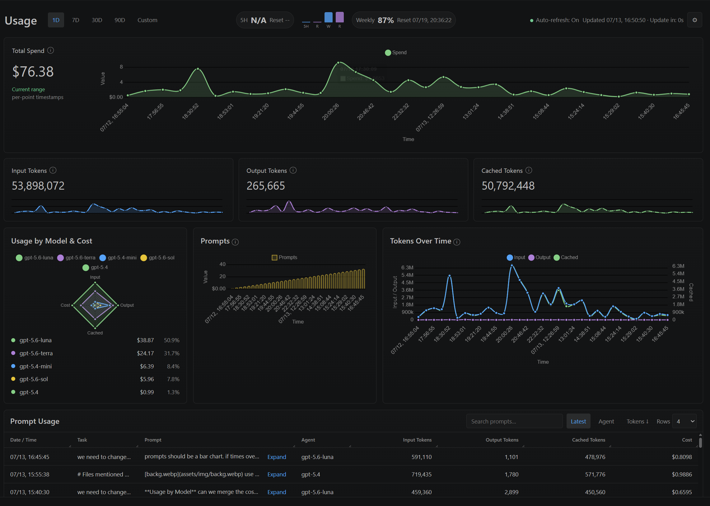
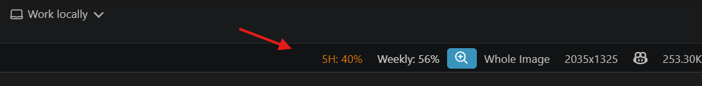

# Codex Usage Monitor

Currently in BETA! <font=0.5px features may change</font>

>

A VS Code extension that displays local Codex usage information in the status
bar and a detailed panel.

It reads the local Codex session journal (`~/.codex/sessions`) and shows every
user prompt and the token usage recorded after that prompt. Clicking the status
bar opens its view in VS Code's bottom Panel area; use **Codex Usage: Refresh**
or the Refresh button to reread the journal immediately.

Middle Lower Panel:


Status Bar:


The status text is:

`5H: 00% / Rst: Time | Weekly: 00% / Rst: Date`

The extension asks the locally installed Codex CLI's `app-server` for
`account/rateLimits/read`. It never sends your Codex auth token to a web
endpoint and never displays stale session-journal quota percentages. If the
live local source is unavailable, it displays `--%` and `--` instead of an
incorrect cached value.

## Development

```powershell
npm install
npm run compile
```

Open this folder in VS Code and press `F5` to launch an Extension Development
Host. The extension activates after startup.

## Install from GitHub

1. Download the latest `.vsix` file from the [Releases page](https://github.com/ITFinesse/VSCode-Codex-Tracker/releases).
2. In VS Code, press `Ctrl+Shift+P` (Or right click .vsxi, install.)
3. Choose **Extensions: Install from VSIX...**.
4. Select the downloaded `.vsix` file and reload VS Code.

## Settings

- `codexUsage.sessionsPath`: use a different Codex session directory.
- `codexUsage.codexPath`: optionally override the Codex executable path.
- `codexUsage.refreshIntervalSeconds`: poll interval, default 60 seconds.
- `codexUsage.historyLimit`: maximum prompts shown, default 100.

## Licence

Copyright (c) 2026 Stephen Stern, ITFinesse.co.uk

This project is licensed under the PolyForm Noncommercial License 1.0.0.

You may use, modify, fork, and redistribute this extension only for
non-commercial purposes. You must retain this copyright notice and give
clear credit to Stephen Stern ITFinesse.co.uk and this repository in redistributed or modified versions.

Commercial use, resale, paid distribution, use in a paid product or service,
and monetisation of this extension or derivative works require prior written
permission from the copyright holder.
